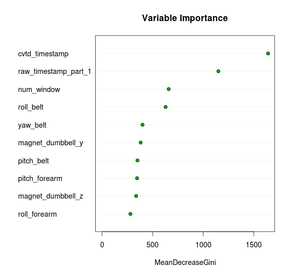
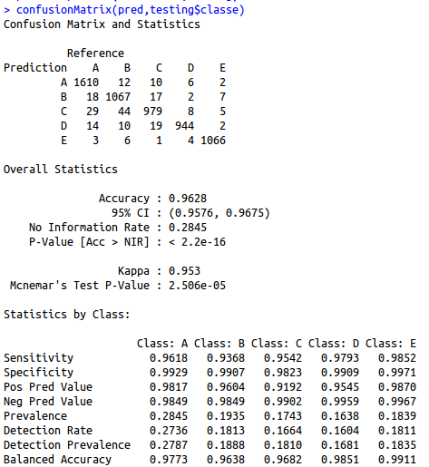

### Exploring the Data
Initally, the final project for this class was very intimidating for me. I explored the data and first noticed many NA's and even some errors that indicated this data was processed in excel, like "#DIV/0!". Once I overcame these though argument settings in the read.csv function, I began to *actually* explore the data. 

After much importing and re-importing, examining and re-examining, I settled on this code for the obligatory first steps:

```
> library(caret); library(doMC);library(ggplot2)
> import <- read.csv("pml-training.csv",na.strings = c("NA","#DIV/0!"))
> realTest <- import <- read.csv("pml-testing.csv",na.strings = c("NA","#DIV/0!"))
> set.seed(8675309)
> inTrain <- createDataPartition(y=import$classe, p=0.7, list=F)
> training<- import[inTrain,]
> testing <- import[-inTrain,]
> rm(import)
```

After this, I found that there were many strange variables that still had many NA's. After much thought and reading, I moved onto the next stage.

### Cleaning the Data, Making the Calls
I made the perhaps-bold decision to throw out any variables which had many NA's because they seemed to be calculated (something I initially saw on the forums, but verified for myself). I planned to see how the modeling performed using only 'raw' data from the participants' sensors. I then proceeded to run test **random forests** (using library randomForest for the initial steps). After some learning, I got the function to execute correctly and worked to evaluate the importance of the variables. For this, I used the varImpPlot function from randomForest. The procedure went like this:

```
> library(randomForest)
> registerDoMC(4)
> trainRF <- randomForest(classe ~.,data=nomiss,ntree=1500,keep.forest=F,importance=T)
> varImpPlot(trainRF,main="Variable Importance",cex=0.9,lcolor="#dddddd",n.var=10,type=2,bg="#00aa00")
```


As you can see, I chose to evaluate the variables using **mean Gini decrease**. Some of the top variables in this plot, such as cvtd\_timestamp, were pretty silly to predict on, since things like time and num\_window (as I understood it) are subject to much change and not related to how you lift a weight, thus including them would make the model significantly less useful in the future. 

For my inital training phase, I decided to only use the **top five variables** and see where it got me. They were: **"roll_belt", "yaw_belt", "magnet_dumbbell_y", "pitch_belt", and "pitch_forearm"**. I proceeded to train my model.

### Model training
Using the top five variables by importance (using mean decrease in gini coeffecient), I began to train my model. I chose to use a random forest for my training since I understood them to be robust and well-suited for a categorial variable such as "classe". It didn't hurt that I have the computing power to perform the training relatively quickly and used only five variables to train on. The procedure went as such:

```
> trainModel <- train(classe ~ roll_belt + yaw_belt + magnet_dumbbell_y + 
                pitch_belt + pitch_forearm, method="rf", data=training)
> pred <- predict(trainModel,testing)
> confusionMatrix(pred,testing$classe)
```


####To my surprise, these were my results:




Fantastic! I've got a 96% accurate model only using five variables! What began as a "try and see" with five variables turned out to be a great model. 

### Results
I applied the above model to the test data and got the following:

```
> answers <- predict(trainModel,realTest)
> answers
 [1] B A B A A E D B A A B C B A E E A B B B
Levels: A B C D E
```

Using the above answers, I got 100% correct. I spent *much* more time exploring my data set and trying to think through the errors and NA's than I did in acutal testing, but it all worked out great. 

### Summary / tl;dr
Here's where I'm just going to explicitly answer the questions in the prompt for this writeup. Think of it as a tl;dr. 

**How you built your model:** I built my model using a random forest through the "rf" method in the train() function of caret. 

**How you used cross validation:** Using a cross-validation 'testing' set I split off from the training set, I applied my model to evaluate its effectiveness.

**What you think the expected out of sample error is:** My expected out of sample error is .0372. This is 1 - .9628, the accuracy in the above confusionMatrix report.

**Why you made the choices you did:** I made a decision to start with the top 5 'most important' variables in the set. To my surprise, these produced a great model. I went with it. 


